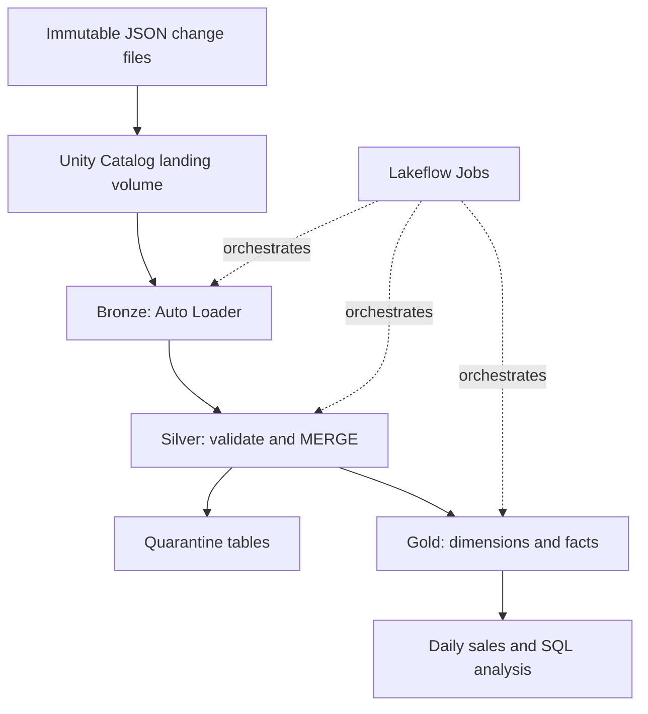

# Azure Retail Lakehouse

A complete learning project for Vishnu Deva Dubey: source files → Bronze → Silver → Gold → SQL analytics. Built with Azure Databricks, PySpark, Auto Loader, Delta Lake, Unity Catalog, and Lakeflow Jobs. Includes a managed-volume quick start and an ADLS Gen2 connection guide.

**Status:** The baseline initial-load scenario passed in Azure Databricks. See the repository root for validation scope. The existing-cluster bundle is an alternative deployment configuration, not the serverless configuration used for the verified run.

## Business problem

An online retailer receives customer, product, region, and order change files. The pipeline ingests new files, validates records, maintains the latest business state, and publishes daily order counts, units sold, and revenue in INR. Each order contains exactly one product in this deliberately small source model. A multi-item commerce system should instead use order header and order-line tables.

## Architecture



Default landing storage is a Unity Catalog managed volume backed by the workspace's configured cloud storage. For your own Azure storage account, follow `docs/ADLS_SETUP.md` first; the same pipeline then uses an external volume. Managed Delta tables use the catalog/schema managed storage, not automatically the external landing container.

## Included files

| File | Purpose |
|---|---|
| `notebooks/00_common.py` | Widgets, names, schemas, audit helper |
| `notebooks/01_setup.py` | Create schemas, volume, and Bronze tables |
| `notebooks/02_seed_demo.py` | Land initial or incremental demo files |
| `notebooks/03_bronze.py` | Incremental file ingestion with persistent checkpoints |
| `notebooks/04_silver.py` | Validation, duplicate handling, latest-version MERGE, soft deletes |
| `notebooks/05_gold.py` | Referential checks, dimensions, order fact, daily sales |
| `notebooks/06_validate.py` | Azure-side demo assertions |
| `databricks.yml` | Deployable three-task job with dependencies and retry settings |
| `data/` | Inspectable JSON fixtures matching the seed notebook |
| `docs/` | ADLS setup, operations, SQL queries, and design explanation |
| `tests/test_package.py` | Offline fixture and package checks |

## 1. Check your workspace

1. Open your Azure Databricks workspace.
2. In Catalog Explorer, find a writable Unity Catalog catalog. The code defaults to `workspace`; change the `catalog` widget if your catalog has another name. Do not use `hive_metastore`.
3. Use Unity Catalog enabled compute on a currently supported LTS Databricks Runtime that supports volumes, at least 13.3 LTS. Use a current LTS available in your workspace rather than selecting an old runtime just for this project.
4. You need USE CATALOG and CREATE SCHEMA on the selected catalog, or ask an administrator to create the four schemas and grant appropriate USE SCHEMA, CREATE TABLE, CREATE VOLUME, and table/volume privileges. The catalog must have valid managed storage for the managed tables/volume.
5. The job identity needs access to the notebooks, tables, volume, and selected compute. For an existing cluster it needs permission to attach and run.

## 2. Import and configure the notebooks

Extract the ZIP locally. In Databricks Workspace create a folder called `azure-retail-lakehouse`. Import all seven `.py` files from `notebooks/` into the same workspace folder as **Python source notebooks**. The `# Databricks notebook source` header makes these importable notebooks. Keep the notebook names unchanged; `%run ./00_common` resolves the shared notebook by name.

Open `01_setup`, attach compute, and run it. The first run displays widgets with these defaults:

| Widget | Default | Meaning |
|---|---|---|
| catalog | workspace | Your existing writable UC catalog |
| prefix | vishnu_retail | Namespace for this project's four schemas |
| batch | initial | Used by demo seeding and demo validation |
| run_id | manual | Audit identifier; job injects its run ID |

If the default catalog is unavailable, set the widget and rerun. Set **the same catalog and prefix on every notebook**. Widget choices are notebook-specific. Use a unique prefix for a clean second demo; do not delete shared data.

Created namespaces are `vishnu_retail_bronze`, `vishnu_retail_silver`, `vishnu_retail_gold`, and `vishnu_retail_ops` under your catalog. The volume path is `/Volumes/<catalog>/vishnu_retail_ops/files`.

## 3. Run the first load

Run these notebooks in order:

1. `01_setup`
2. `02_seed_demo` with `batch=initial`
3. `03_bronze`
4. `04_silver`
5. `05_gold`
6. `06_validate` with `batch=initial`

Expected results: two active orders, three units, total revenue **₹250.00**. Customer name is Asha Singh. Files remain immutable after landing.

## 4. Run the incremental scenario

Set `batch=incremental` in `02_seed_demo` and run it, then run `03_bronze`, `04_silver`, and `05_gold`. Run `06_validate` with `batch=incremental`.

| Change | Expected behavior |
|---|---|
| O1 quantity 2 → 3, sequence 2 | Update existing order |
| O2 deletion, sequence 2 | Keep Silver tombstone; exclude from Gold |
| New O3 with two units at ₹50 | Insert into Silver and Gold |
| Duplicate O1 update | Collapse identical duplicate |
| Late O1 sequence 1 | Cannot replace sequence 2 |
| BAD1 quantity -2 | Exclude from Silver; keep in quarantine |
| Customer name/email update | Apply SCD Type 1 current-state change |

Expected results: **two active orders, five units, ₹400.00 revenue**, customer name Asha Sharma, one quarantined bad order, O2 marked deleted in Silver. O3 has the same order date as the initial sample, so daily aggregates restate September 1.

Run Bronze → Silver → Gold → validation again without adding files. Business totals should stay unchanged. Bronze file discovery is checkpointed; Silver MERGE accepts only newer sequence values. Audit rows intentionally append on each attempt and are not an exactly-once event ledger.

Do not run the initial validation after the incremental scenario: its expected revenue is intentionally different.

## 5. Orchestrate automatically

The seed and setup notebooks run manually once. Only Bronze → Silver → Gold belongs in the recurring job.

**UI option:** In Jobs & Pipelines create a job with three notebook tasks and dependencies `bronze → silver → gold`. Select the same existing compute, configure one concurrent run, a 30-minute timeout per task, and one retry. Pass `catalog`, `prefix`, and `run_id={{job.run_id}}` as notebook parameters. Start with manual runs. Add your desired schedule only after the demo passes. Configure failure notifications to your own email if needed.

**CLI option:** Install the current Databricks CLI following its official installation guide. From the extracted project folder, authenticate and deploy:

```bash
databricks auth login --host https://YOUR-WORKSPACE-HOST --profile retail
export BUNDLE_VAR_catalog=workspace
export BUNDLE_VAR_prefix=vishnu_retail
export BUNDLE_VAR_cluster_id=YOUR_EXISTING_CLUSTER_ID
databricks bundle validate -t dev --profile retail
databricks bundle deploy -t dev --profile retail
databricks bundle run -t dev retail_pipeline --profile retail
```

Substitute your actual catalog and cluster ID. The bundle syncs the shared notebook and task notebooks. Run setup and seed first using the same namespace. No schedule is enabled by the supplied bundle. Existing compute is used to avoid assuming your available Azure VM types or creating resources silently. For repeated production runs, consider a job cluster that terminates after completion and evaluate its cost against your workspace options.

## 6. Query the result

Run the queries in `docs/ANALYTICS.sql` in a notebook SQL cell, or a SQL editor with available SQL compute. Replace `workspace` and the prefix if changed. A separate always-on SQL warehouse is not required for the notebook demo. Power BI can be added later against the Gold tables; its dashboard and credentials are outside this package.

## Cost controls

This project is **low-cost by design, not guaranteed free**. Use small demo files, manual job runs, and the smallest suitable compute permitted by your workspace. Set short auto-termination on existing compute and stop it after exercises. Auto Loader uses `availableNow` to process the available input then finish; this does not itself terminate an all-purpose cluster. Do not leave a separate warehouse running. Azure budgets notify you; they are not automatic hard spending caps. Azure rates depend on your region, VM, pricing plan, and trial credits.

The project does not require ADF, Event Hubs, or a continuously running pipeline. New immutable JSON files under each landing entity folder are the source interface.

## Deliberate scope and limitations

- Bronze is incremental. Silver rescans Bronze history for simplicity and robust late-event handling, then merges newer versions. Gold fully rebuilds small current-state tables. This is not an end-to-end incremental implementation at large scale.
- Customers use SCD Type 1; historical attribute snapshots and SCD Type 2 are not implemented. Gold uses natural business keys. Product price changes do not rewrite historical revenue because price is captured on the order.
- Change files simulate CDC; there is no live database CDC connector. They are full after-images (`U`) or keyed tombstones (`D`).
- Schema changes are rescued and quarantined rather than silently promoted. Update the explicit schema and transformation deliberately, then replay corrected files with a new event ID and higher sequence.
- Gold table replacement is atomic per table, not across all tables. The successful publish audit marker is written last. Consumers should read after a successful job; production systems needing a consistent multi-table snapshot should use versioned publication.
- All values are synthetic. SQL query examples are included; a separate BI dashboard is not.

See `docs/OPERATIONS.md` for recovery and `docs/DESIGN.md` for data contracts and scaling decisions.

## Verification

Run `python -m unittest discover -s tests -v` locally. These tests validate fixture scenarios, notebook syntax, and workflow ordering; they do not run Spark, Auto Loader, Delta MERGE, permissions, or Azure networking. Use `06_validate` in Databricks to verify actual pipeline output, then rerun the job to verify unchanged totals. Bundle validation must run against your configured workspace.

## Official references checked for this package

- https://learn.microsoft.com/en-us/azure/databricks/ingestion/cloud-object-storage/auto-loader/
- https://learn.microsoft.com/en-us/azure/databricks/ingestion/cloud-object-storage/auto-loader/unity-catalog
- https://learn.microsoft.com/en-us/azure/databricks/ingestion/cloud-object-storage/auto-loader/production
- https://learn.microsoft.com/en-us/azure/databricks/delta/merge
- https://learn.microsoft.com/en-us/azure/databricks/connect/unity-catalog/cloud-storage/azure-managed-identities
- https://learn.microsoft.com/en-us/azure/databricks/connect/unity-catalog/cloud-storage/external-locations-adls
- https://docs.databricks.com/aws/en/dev-tools/bundles/settings
- https://learn.microsoft.com/en-us/azure/databricks/dev-tools/cli/install
