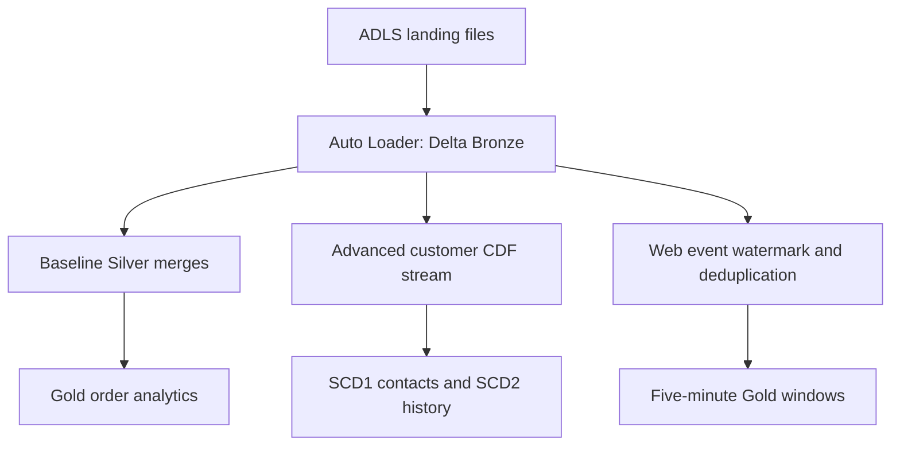

# Azure Retail Lakehouse

A retail data engineering portfolio project by Vishnu Deva Dubey using Azure Databricks, ADLS Gen2, PySpark, Delta Lake and Unity Catalog.

Customer updates and order files arrive at different times, may be duplicated, and may contain invalid records. This project turns synthetic retail change files into current customer state, historical customer profiles and analytical tables, with explicit recovery and validation checks.

## Architecture



The baseline and advanced extension use separate tables and source fixtures. Unity Catalog governs access; the verified Azure setup used an Access Connector managed identity for ADLS access.

## What is implemented

| Area | Implementation |
|---|---|
| Ingestion | File-based Auto Loader, explicit schemas, persistent checkpoints |
| Storage | Delta Bronze, Silver and Gold tables; Unity Catalog volume for files |
| Baseline | Customers, products, regions and orders; latest-record merges and revenue analytics |
| Advanced customers | Delta CDF, SCD1 contacts, SCD2 profile history, late history insertion, soft deletes |
| Advanced events | Ten-minute event-time watermark, deduplication, separate five-minute aggregation stream |
| Quality | Invalid-record quarantine, phase checks, audit tables, no-new-input replay checks |
| Orchestration | Manual Databricks jobs with dependencies or a single advanced demo task |

## Verified results

On September 10, 2026, the advanced Azure run succeeded. User-supplied run output showed all demo assertions passing before and after replay. Checked row counts remained unchanged. The baseline initial load had also succeeded. See [validation evidence and limits](docs/VALIDATION.md).

| Demo result | Observed output |
|---|---|
| Latest C1 contact | Sequence 4, final email, South region |
| C1 history | North → West → South with contiguous validity intervals |
| C2 deletion | Closed East history and current deletion tombstone |
| Finalized web windows | Counts 3, 1 and 2 |
| Customer CDF audit | Eight source rows across four batches, one rejected row |

## Repository

- `baseline/`: seven notebooks, JSON fixtures, analytics SQL, design and operations notes, optional existing-cluster bundle.
- `advanced/`: two notebooks, five-phase fixtures, serverless job deployment helper and offline tests.
- `docs/VALIDATION.md`: verified scope and known limitations.

Start with [baseline setup](baseline/README.md), then [advanced setup](advanced/README.md). Configure your own workspace and catalog. Azure resources and permissions must already exist; this repository does not automatically provision Azure infrastructure.

## Cost-conscious execution

Use the small synthetic fixtures and manual runs. Review configuration before starting compute. Deployment and execution are separate steps; no schedule is enabled by default. This project is not guaranteed free. Do not leave unrelated clusters or warehouses running after exercises.

## Scope and limitations

This is a personal learning project, not a production deployment or evidence of production-scale throughput. Baseline Silver scans Bronze history; baseline Gold rebuilds small tables. The extension adds incremental customer CDF processing in separate tables. Source CDC is simulated using JSON after-images, not a live database connector. ADF, Event Hubs, Power BI and a Lakeflow declarative pipeline are not implemented here. Revenue-by-region uses current customer state, not an order-time SCD2 join. A no-new-input replay test is not proof of correctness for every failure or concurrency scenario.

Public source contains both logging fixes validated during the demo. It is a portable source package, not a byte-for-byte export of workspace metadata. Public configuration changes and the optional bundle have not been rerun in Azure.

## Local checks

```bash
python3 -m unittest discover -s baseline/tests -v
python3 -m unittest discover -s advanced/tests -v
```

No cloud credentials are required for these offline tests. Live Spark and Azure integration are validated separately.
