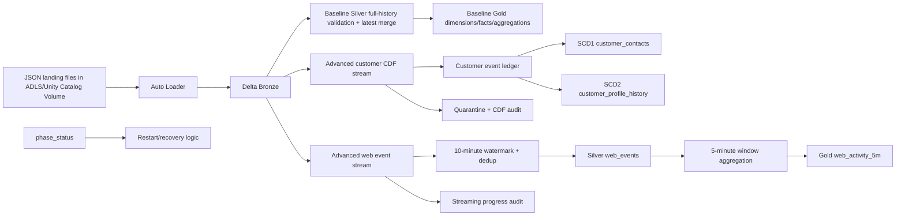

# Azure Retail Lakehouse — Implementation and Interview Guide

This document explains what the project actually implements, what was successfully tested in Azure, and what remains outside the verified scope. It is intentionally precise so the project can be discussed accurately in interviews without overstating production experience.

## 1. Project goal

The project is a small retail lakehouse built with Azure Databricks, ADLS Gen2, PySpark, Delta Lake, Structured Streaming and Unity Catalog.

It demonstrates two related implementations:

1. **Baseline lakehouse** — file ingestion into Bronze, data-quality processing into Silver, and business-ready Gold tables for retail orders.
2. **Advanced extension** — incremental customer processing with Delta Change Data Feed (CDF), SCD Type 1 current state, SCD Type 2 history, delete handling, late-arriving changes, streaming web-event deduplication with a watermark, five-minute window aggregation, quarantine, progress auditing, phase recovery and replay validation.

The two parts share the same overall Azure lakehouse environment, but the advanced demo uses separate `advanced_v1_*` tables and separate source/checkpoint paths so it does not overwrite the baseline outputs.

---

## 2. High-level architecture



---

## 3. Baseline implementation

### Bronze

The Bronze notebook uses Databricks Auto Loader with Structured Streaming. Each entity is read from its landing directory using an explicit schema. The stream writes append-only Delta Bronze tables and uses persistent checkpoints.

The baseline entities are:

- customers
- products
- regions
- orders

Auto Loader also captures source metadata and supports rescued data. The stream uses `availableNow=True`, which is useful for a cost-conscious demo because it processes the available files and then terminates instead of running continuously.

### Silver

The baseline Silver implementation deliberately reads the Bronze history for each entity instead of using CDF.

It performs:

- type conversion
- envelope validation
- payload validation
- duplicate/conflict detection
- invalid-record quarantine
- latest-record selection by business key and sequence
- Delta `MERGE`
- soft-delete/tombstone retention

For each business key, the highest valid sequence represents the current record. A target row is updated only when the incoming sequence is greater than the stored sequence.

This is an important interview distinction:

> **The baseline Silver layer is not fully incremental CDF processing. It rescans Bronze history and then performs idempotent latest-record merges.**

That choice is acceptable for the tiny learning dataset because it simplifies late-event correctness, but it would need redesign for large production volumes.

### Gold

The baseline Gold layer builds retail analytics from the Silver state, including current dimensions/facts and sales aggregation. The initial verified baseline run produced two active orders with total revenue of 250.

---

## 4. Advanced customer pipeline

The advanced demo enables Delta Change Data Feed on its Bronze customer-change table and processes new Bronze changes incrementally.

### Source contract

Customer change records contain fields such as:

- `event_id`
- `customer_id`
- `sequence`
- `effective_at`
- customer attributes
- `op`

`op='U'` represents an insert/update after-image. `op='D'` represents a business deletion.

The source envelope is append-only. Therefore, the CDF consumer intentionally processes CDF rows where `_change_type='insert'`. The business delete is represented inside the inserted change envelope as `op='D'`; it is not a physical Delta delete from the Bronze table.

### Incremental CDF processing

The stream reads the Bronze customer-change Delta table with:

```python
.option('readChangeFeed', 'true')
```

It then uses `foreachBatch` to apply validation and idempotent Delta operations.

The customer checkpoint is persistent. On the verified run, the CDF audit confirmed eight delivered customer source rows across four customer batches, including one rejected row. This demonstrates that the advanced customer path consumes new CDF changes rather than rescanning the entire customer Bronze history on every phase.

### Customer event ledger

Valid customer changes are merged into a Silver `customer_events` table keyed by `event_id`.

The ledger is important because it gives the pipeline a stable source from which current state and historical state can be recomputed for affected customers. It also supports recovery if a failure happens after one write has already committed.

The implementation checks for conflicting reuse of:

- `event_id`
- `(customer_id, sequence)`

Exact duplicates can be replayed safely, while conflicting content fails instead of silently selecting an arbitrary record.

---

## 5. SCD Type 1 — current customer contacts

`advanced_v1_customer_contacts` represents the latest customer state.

For each affected customer, the pipeline orders events by descending sequence and selects the newest event. It then merges that record into the current-state table.

An update happens only when:

```text
incoming sequence > stored sequence
```

This is SCD Type 1 behavior because the table keeps one current representation of the customer rather than a row for every historical version.

The verified demo ended with customer C1 at sequence 4 with the final email and South region.

### Delete handling

A business delete is retained as a tombstone with `is_deleted=true` rather than physically removing the customer state. This prevents an older late-arriving update from accidentally resurrecting a deleted customer.

A later explicit update with a higher sequence could reactivate the customer if that behavior is part of the source contract.

---

## 6. SCD Type 2 — customer profile history

`advanced_v1_customer_profile_history` stores historical profile states.

The advanced demo intentionally tracks **region and deletion state** as the Type 2 attributes. It does not create a new historical row for every email-only change.

For each affected customer, the pipeline rebuilds the history from the idempotent event ledger and derives:

- `valid_from`
- `valid_to`
- `is_current`
- `customer_version_key`

### Verified late-arriving example

The source deliberately delivers C1 sequence 3 before sequence 2:

1. Sequence 1 — North
2. Sequence 3 — South arrives first
3. Sequence 2 — West arrives later
4. Sequence 4 — email changes while region remains South

After the late sequence 2 arrives, the SCD2 history is corrected to:

```text
North  -> West -> South
Sep 1     Sep 2   Sep 3 onward
```

The sequence 4 email-only update does **not** create a fourth SCD2 region version because the tracked Type 2 state did not change.

This is more meaningful than simply appending history in arrival order: the demo validates business sequence/effective-time ordering and reconstructs the affected customer's historical intervals correctly.

---

## 7. Quarantine and data quality

Invalid customer records are written to an ops quarantine table.

The demo includes an intentionally invalid customer change with an invalid sequence/email. Invalid records are identified before they can update current or historical customer state.

The quarantine merge uses a record hash so replaying the same invalid source record does not repeatedly create duplicate quarantine records.

The verified advanced run processed one rejected customer row.

---

## 8. Advanced web-event streaming

The project also contains an independent web-event streaming example.

### Bronze ingestion

Web-event JSON files are ingested with Auto Loader into a Delta Bronze table using a persistent checkpoint.

### Watermark and deduplication

The Silver web stream converts `event_time` to a timestamp and rejects null/invalid key fields. It then applies:

```python
.withWatermark('event_time', '10 minutes')
.dropDuplicatesWithinWatermark(['event_id'])
```

This demonstrates stateful event-time deduplication. The watermark limits how long Spark must retain state for duplicate detection and also establishes a boundary for sufficiently late events.

### Separate aggregation stream

The project deliberately uses a second stream and a second checkpoint for aggregation rather than chaining multiple stateful operators into one query.

The aggregation stream reads the deduplicated Silver web-event table, applies a 10-minute watermark, groups data into five-minute windows by page, and writes results to the Gold `web_activity_5m` table.

The verified finalized windows were:

| Window | Page | Event count |
|---|---|---:|
| 10:00 | `/shop` | 3 |
| 10:05 | `/shop` | 1 |
| 10:25 | `/checkout` | 2 |

This demonstrates both duplicate handling and event-time-based aggregation.

---

## 9. Recovery and idempotency design

The advanced demo is intentionally restart-aware.

### Persistent checkpoints

Each streaming path has its own checkpoint, including:

- Bronze customer ingestion
- Bronze web ingestion
- customer CDF processing
- web-event deduplication
- web-event aggregation

These checkpoints must be preserved during recovery. Deleting them would change the stream's processing history and could cause data to be read again.

### Phase tracking

The demo runs in five phases. Successfully completed phases are recorded in `phase_status`.

When the notebook is rerun, completed phases are skipped. This protects the intended temporal order of the demo and avoids blindly replaying every phase from the beginning.

### Idempotent writes

The implementation uses Delta merges and deterministic event/history logic so already committed writes can be encountered safely after a partial failure.

This mattered during debugging because some writes could have committed before the notebook failed in progress logging.

### No-new-input replay test

After all five phases, the notebook captures row counts for key tables, reruns ingestion/customer/web processing with no new source files, captures the counts again, and asserts that they are unchanged.

The successful Azure run passed this assertion and then ran the full final checks again.

This validates the tested no-new-input replay scenario. It does **not** prove correctness for every possible concurrent writer, crash timing, schema change or production-scale failure scenario.

---

## 10. Streaming progress audit and the two fixes

The advanced project stores streaming progress information in an ops table.

During the live Azure run, two serverless-specific robustness problems were discovered.

### Fix 1 — missing metrics

Some progress entries did not provide every metric. The original code tried to convert a missing value with `int(None)`.

The deployed implementation was changed so that it:

- tolerates missing `recentProgress`
- skips entries without `batchId`
- keeps missing `numInputRows` as null
- safely handles missing `eventTime`
- safely handles missing `stateOperators`
- keeps unavailable dropped-row metrics as null rather than inventing zero

### Fix 2 — UUID JSON serialization

A later run showed that a progress object could contain a UUID value that standard `json.dumps()` could not serialize.

The fix was:

```python
json.dumps(progress, default=str)
```

The final successful Azure run executed after both fixes.

---

## 11. Validation status

### Implemented and successfully tested in Azure

| Capability | Status |
|---|---|
| Baseline Auto Loader to Delta Bronze | Tested |
| Baseline Silver validation/latest merge | Tested |
| Baseline soft deletes/quarantine | Tested |
| Baseline Gold retail output | Tested |
| Advanced customer CDF ingestion | Tested |
| SCD Type 1 customer contacts | Tested |
| SCD Type 2 profile history | Tested |
| Late-arriving customer history insertion | Tested |
| Business deletion/tombstone handling | Tested |
| Invalid customer quarantine | Tested |
| Web-event watermarking | Tested |
| Web-event deduplication | Tested |
| Five-minute window aggregation | Tested |
| CDF/stream audit tables | Tested |
| Phase recovery state | Tested in the successful recovery sequence |
| Missing-metric logging fix | Tested |
| UUID progress serialization fix | Tested |
| No-new-input replay with unchanged checked counts | Tested |

### Implemented but should not be overstated

- The baseline Silver path uses full Bronze-history reads; it is not CDF-based incremental Silver.
- The advanced CDF implementation is demonstrated for the customer-change path, not every baseline entity.
- The dataset is synthetic and small.
- The source CDC feed is simulated with JSON change files rather than a live transactional database connector.
- The replay test covers the demonstrated no-new-input scenario, not every possible failure mode.

### Not implemented in this repository

The repository should not be described as containing these unless they are added and tested later:

- Azure Data Factory orchestration
- Event Hubs/Kafka live ingestion
- Power BI semantic/reporting layer
- Lakeflow Declarative Pipelines/DLT implementation
- production-scale load/performance testing
- production CI/CD release process
- full incremental CDF processing for all baseline Silver entities

---

## 12. End-to-end interview explanation

A concise way to explain the project is:

> I built a retail lakehouse on Azure Databricks using ADLS Gen2, Unity Catalog, PySpark and Delta Lake. In the baseline pipeline I ingest customer, product, region and order JSON files with Auto Loader into Bronze Delta tables using checkpoints. Silver performs validation, quarantine, duplicate checks, sequence-based latest-record logic and Delta merges with soft-delete tombstones, and Gold creates retail analytics. The baseline Silver intentionally rescans its small Bronze history, so I do not describe that part as fully incremental.
>
> I then built an advanced extension to demonstrate incremental patterns. Customer changes are processed from Delta Change Data Feed with a checkpointed Structured Streaming `foreachBatch` pipeline. I keep an idempotent customer event ledger, build an SCD Type 1 current contact table, and rebuild SCD Type 2 region/deletion history for affected customers so a late sequence can be inserted into the correct historical interval. I also created a separate web-event stream using a 10-minute watermark and event-ID deduplication, followed by a second stream that produces five-minute Gold window aggregates.
>
> I added quarantine, CDF batch auditing, streaming progress auditing and phase-state recovery. During Azure testing I fixed two real serverless progress-logging issues—missing metrics causing `int(None)` and UUID values failing JSON serialization. The final run passed all advanced assertions and a no-new-input replay where the checked output counts remained unchanged.

---

## 13. Likely interview follow-ups

### Why use CDF?

CDF lets the advanced customer stream consume Delta changes incrementally rather than repeatedly scanning the entire source history. The checkpoint tracks stream progress, while the event ledger and merges make the downstream processing repeatable.

### Why keep a customer event ledger?

It provides a deterministic history of accepted business changes. That makes it possible to rebuild the state for only affected customers and recover when a previous attempt committed an upstream write before failing later.

### Why SCD1 and SCD2 together?

They serve different use cases. SCD1 gives the latest operational customer state. SCD2 preserves selected historical attributes—in this demo, region and deletion status—so historical changes can be analyzed over time.

### How is a late-arriving record handled?

The pipeline uses sequence as the authoritative business ordering, validates that effective times increase with sequence, then recomputes the affected customer's history from the event ledger. That is how sequence 2 could arrive after sequence 3 but still become the middle North → West → South interval.

### Why use a watermark?

Stateful stream operations such as event deduplication cannot retain an unbounded amount of state forever. A watermark gives Spark an event-time threshold for state cleanup and defines how late data can be before the stateful operation may no longer accept it.

### Why separate deduplication and window aggregation streams?

Each stateful stage has its own query and checkpoint. That makes the streaming topology easier to reason about and avoids chaining the two stateful operations into one query for this demonstration.

### Is this production ready?

No. It demonstrates production-oriented patterns, but the workload is intentionally small and synthetic. A production design would require scale tests, security/network design, monitoring/alerting, schema governance, CI/CD, recovery testing, concurrency controls and source-specific CDC integration.

---

## 14. Key rule for describing the project

The safest accurate statement is:

> **Baseline = working lakehouse with Auto Loader + Delta + full-history Silver latest-state merges. Advanced extension = tested incremental customer CDF + SCD1/SCD2 + watermark/dedup/window streaming + recovery/audit validation.**

Keeping that distinction prevents the project from being described as more incremental or production-scale than what was actually implemented and tested.
